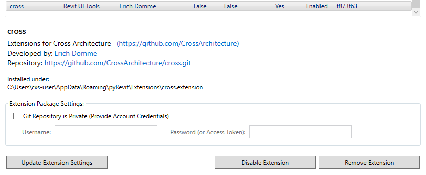
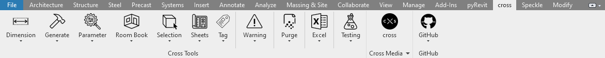

<h1 align="center">
  <a name="logo" href="https://www.cross-architecture.net/"></a>
  <br>
  Cross Architecture <br>
  Cross-Tools by Erich Domme
</h1>

<div align="center"></div>

<p><font size="3">
The purpose of this repository is to document all "Cross-Tools", how they work, the idea behind them and how they were implemented! The project was developed during an internship at Cross Architecture Aachen as part of the Master in Construction and Robotics at RWTH Aachen University. The aim was to implement a set of tools that the entire Cross Architecture team could use to simplify and in many cases automate repetitive, tedious and complicated tasks in their daily work with Revit. These quality of life tools were constantly tested and adapted to the working conditions. </p>

<!-- LINKS -->

<div align="center"><a name="menu"></a>
  <h4>
    <a href="https://www.pinterest.de/cross_architecture/">
      Pinterest
    </a>
    <span> | </span>
    <a href="https://www.facebook.com/CROSSArchitecture/">
      Facebook
    </a>
    <span> | </span>
    <a href="https://www.linkedin.com/company/cross-architecture/mycompany/">
      LinkedIn
    </a>
    <span> | </span>
    <a href="https://www.instagram.com/cross_architecture/">
      Instagram
    </a>
    <span> | </span>
    <a href="https://www.cross-architecture.net/">
      Homepage
    </a>
  </h4>
</div>

## Table of Contents
* [General Info](#general-information)
* [Requirements](#requirements)
* [Installation](#installation)
* [Features](#features)
* [Screenshots](#screenshots)
* [Setup](#setup)
* [Usage](#usage)
* [Project Status](#project-status)
* [Room for Improvement](#room-for-improvement)
* [Acknowledgements](#acknowledgements)
* [Contact](#contact)
<!-- * [License](#license) -->

## General Information
Cross-Tools is a collection of tools based on Dynamo and/or Python. The aim of these tools is to make your daily work with Revit easier. During the course of a building project, our architects are faced with a number of tasks that need to be completed. These tasks can often be repetitive and time consuming. That's why Cross Tools are designed to help with automation and management tasks. This includes facilitating the creation of plan sheets as well as alert management in the model. Under [Features](#features) all tools are listed and described in their use case.


## Requirements
> It is assumed that you have Autodesk Revit installed on your computer!<br>
> Revit 2021 has been used for development!<br>
> Except for pyRevit, the other requirements are not mandatory! But they might be, as I will be looking at the extensions in the future!
1. [pyRevit](https://github.com/eirannejad/pyRevit/releases/tag/v4.8.12.22247%2B0031)
2. [RevitPythonShell](https://github.com/architecture-building-systems/revitpythonshell)
3. [RevitLookup](https://github.com/jeremytammik/RevitLookup)
4. [Revitron](https://github.com/revitron/revitron)
5. [Revitron-UI](https://github.com/revitron/revitron-ui)
6. [Speckle](https://speckle.systems/)

## Installation
In order for Cross-Tools to run on your computer, you will need to do a few installations beforehand. Cross-Tools is based on pyRevit and this is where we start.
1. Make sure you have Autodesk Revit installed on your computer!
2. Install the latest [pyRevit version](https://github.com/eirannejad/pyRevit/releases), during the development of Cross-Tools the version [v4.8.12.22247](https://github.com/eirannejad/pyRevit/releases/tag/v4.8.12.22247%2B0031) was used. The installation is self-explanatory and very well documented, but a look at the [Notion Page](https://pyrevitlabs.notion.site/pyrevitlabs/pyRevit-bd907d6292ed4ce997c46e84b6ef67a0) is worthwhile.
3. After the successful installation of pyRevit, Navigate now to the extensions of pyRevit, under the first tab. 
<div align="center">

</div>

4. You should now see a list of all extensions that are either written by pyRevit itself or recommended by pyRevit, this is the __pyRevit Extension Manager__. We now want to add "Cross-Tools" to this list!
> __"Cross-Tools" should not be visible to you yet, as shown in the screenshot below!__<br>

<div align="center">

</div>


5. To do this, we need to find the location of these listed extensions. They are written inside a json file, with the name "extensions.json"! This should be found here:<br>
`C:\Users\cxs-user\AppData\Roaming\pyRevit-Master\extensions\`

6. Add the following code snippet at the end of the json file:
> :warning: **You will need admin rights here!** Be very careful! If in doubt, contact your IT support!
````
        {
            "builtin": "False",
            "default_enabled": "True",
            "type": "extension",
            "rocket_mode_compatible": "False",
            "name": "Cross-Tools",
            "description": "Extensions for Cross Architecture",
            "author": "Erich Domme",
            "author_profile": "https://github.com/CrossArchitecture",
            "url": "https://github.com/CrossArchitecture/Cross-Tools.git",
            "website": "https://github.com/CrossArchitecture",
            "image": "",
            "dependencies": []
        }
````
> __Make sure you place the commas in the right place!__
````
{
    "extensions": [
        {
            n. Extension
        },
        {
            Cross-Tools
        }
    ]
}
````

7. Depending on your system it may be enough to reload pyRevit __and__ update it once. However, my recommendation would be a __restart__ of Revit. Any changes will be added automatically. 

8. Navigate to the __pyRevit Extension Manager__ again. You should now be able to see "Cross-Tools"!

<div align="center">

</div>

9. "Cross-Tools" is a private repository. Therefore the check box "Git repository is private" has to be checked! If you want to get the access token, contact [me](mailto:erich.domme@rwth-aachen.de)!

<div align="center">

</div>

10. In contrast to me, "Cross-Tools" will not yet be installed in your Revit. You should do this by clicking on Install Extension.

<div align="center">

</div>

11. Done! You should now have "Cross-Tools" in Revit!

<p align="center">
  
</p>
<p align="center"><font size="3">
Congratulations!</p>


## Features
* __Dynamo__
  * Beam(s) through input Surface
  * Excel Export
  * Delete selected unplaced Views
  * Warning Management
  * Reset Graphical Override
* __Python__
  * Center Room Tag
  * Same category as selected
  * same type as selected
  * Titleblocks on sheets
  * Select only categories
  * Select only 3D
  * Select only 2D
  * Deselect grouped elements


## Screenshots
<div align="center">

<p>The "Cross-Tools" Extension visible in the Revit toolbar</p>
</div>

## Usage


## Project Status
Project is: 
<span style="color:yellow">**IN PROGRESS!**</span>
<!-- _complete_ / _no longer being worked on_. If you are no longer working on it, provide reasons why.-->


## Room for Improvement
Room for improvement:
- Improvement to be done 1
- Improvement to be done 2

To do:
- Feature to be added 1
- Feature to be added 2


## Acknowledgements
Without these people and their projects, Cross-Tools would not have been possible:
- [Ehsan Iran-Nejad](https://github.com/eirannejad) with [pyRevit](https://github.com/eirannejad/pyRevit)
- [Erik Frits](https://github.com/ErikFrits) with [EF-Tools](https://github.com/ErikFrits/EF-Tools)
- [Gavin Crump, aussieBIMguru](https://github.com/aussieBIMguru) with [guRoo](https://github.com/aussieBIMguru/guRoo/tree/main/guRoo.tab/Tools.panel)
- [Marc Anton Dahmen](https://github.com/marcantondahmen) with [revitron](https://github.com/revitron/revitron)
- [Jean-Marc Couffin](https://github.com/jmcouffin) with [bimone](https://github.com/bimone/scripts-dynamo)


## Contact
Created by [Erich Domme](mailto:erich.domme@rwth-aachen.de) - feel free to contact me!


<!-- Optional -->
<!-- ## License -->
<!-- This project is open source and available under the [... License](). -->

<!-- You don't have to include all sections - just the one's relevant to your project -->